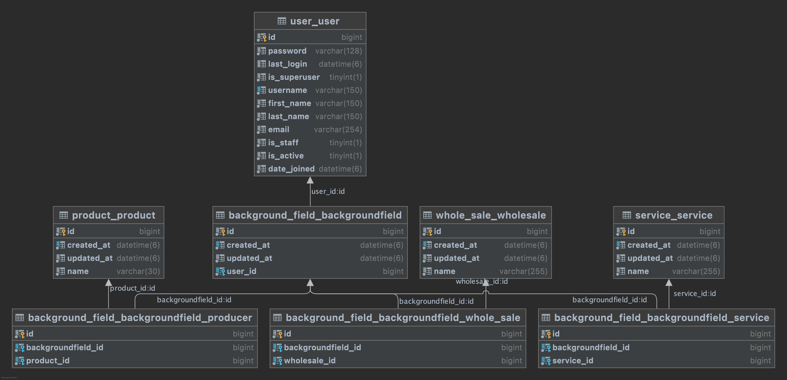

# Bazar Wep Application
The Bazar wep application helps sellers and buyers to communicate easily with each other.

## Dependencies/Tools
- Python v+3.9
- RDBMS (MySQL)
- Gunicorn(eventlet)
- Docker/DockerCompose
- Flake8/Black
- JWT
- WhiteNoise (to serve static files)

## Development
to run in development mode, be sure have running at least one desire db (RDBMS) and Redis on local machine. 
Also needs to python +3.9 has been installed as virtualenv or global in your machine, then to have
local config do:
```shell
cd /root/of/project
pip install -r requirements.txt
cp example.env .env
```
and fill .env variables with your local machine setup.
Run django:
```shell
# First activate python virtual venv. then:
cd /root/of/project
python manage.py runserver
```
## Production
First create `.env.docker` file for docker compose mode, and fill the keys with any value needs:
```shell
cd /root/of/project
cp example.env .env.docker
```
Then run using docker compose:
```shell
cd /root/of/project
docker compose up -d
```
**Note:** If it is first time that you run the app using docker compose, the superuser will be created by username `admin` and password based 
on the value of `DJANGO_SUPERUSER_PASSWORD` key from  `.env.docker` config, which default value is `admin`
## Test
```shell
cd /root/of/project
python manage.py test
```

## Endpoints
Based on the interview task, seems [This Admin Page](http://0.0.0.0:8000/admin/background_field/backgroundfield/add/) will satisfy task goal.
## Diagram
UML diagram:<br>


## Postman API Collection
Feel free to use following interface to access to the user-friendly postman collection:<br><br>
[](https://app.getpostman.com/run-collection/17643684-d2206f72-31eb-4c84-a08e-22effcecc648?action=collection%2Ffork&collection-url=entityId%3D17643684-d2206f72-31eb-4c84-a08e-22effcecc648%26entityType%3Dcollection%26workspaceId%3Deb171529-de03-47de-bceb-0050cab7da49)
<br><br>Also, an exported postman collection file placed at directory [docs/api_postman_collection.json](docs/api_postman_collection.json) which will help if need to import it in the local Postman.